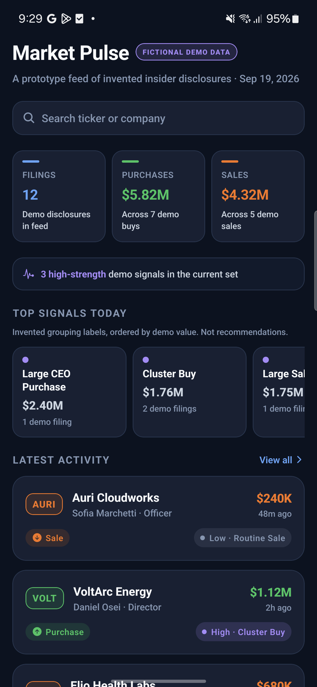
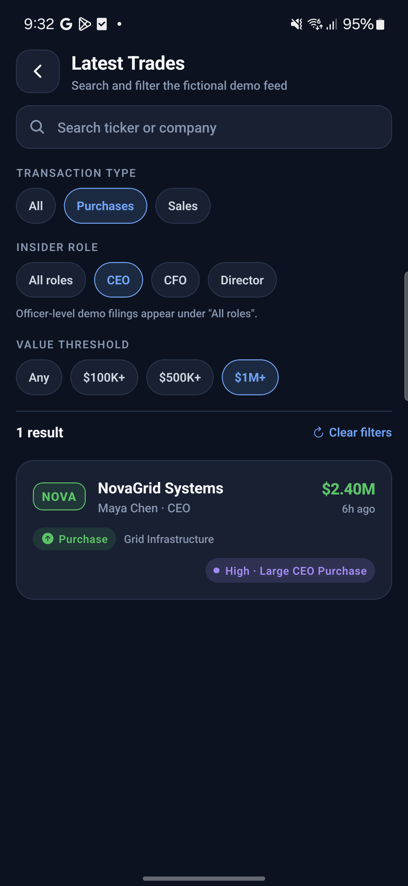
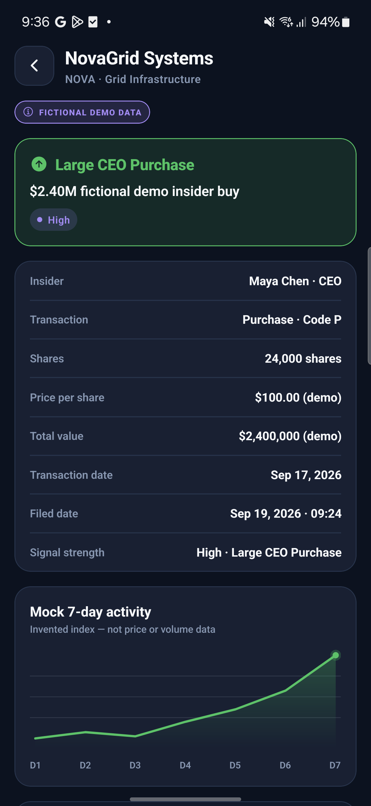
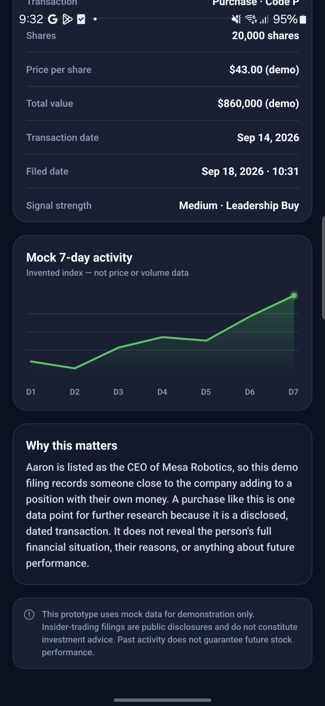
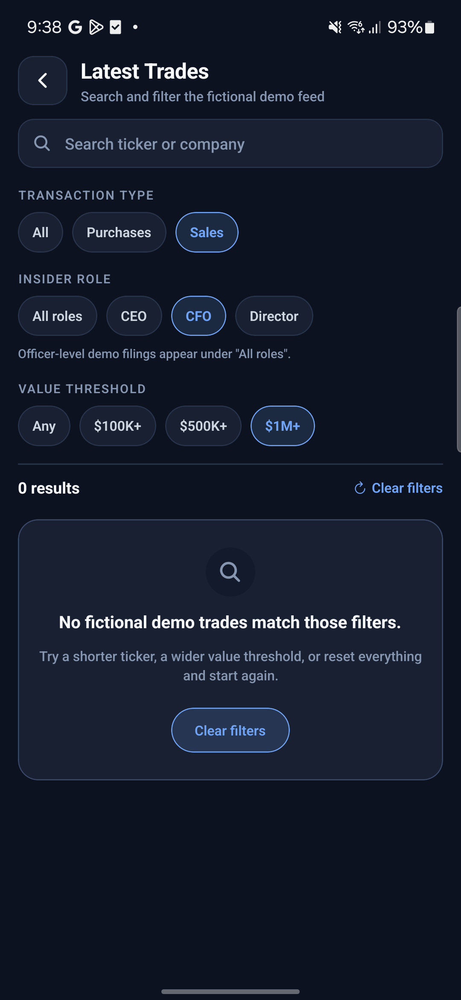

# Signal Desk

**A three-screen React Native prototype for scanning fictional insider-activity records on mobile.**

Original mobile concept inspired by the broad insider-activity product category; all displayed
content is fictional mock/demo data.

---

## Project overview

Disclosed insider transactions are, in principle, public information — but on a phone they are
awkward to work with. The raw form is a long, undifferentiated list in which a routine $200K
scheduled sale looks exactly like a $2.4M purchase by a sitting CEO, and the reader has to hold
several variables in their head at once (who, which direction, how much, how recently) before
anything stands out.

Signal Desk is a prototype answer to one narrow question: **on a small screen, how quickly can
someone go from "show me what happened" to "I understand this one filing"?**

It does that in three steps:

1. **Market Pulse** — an immediate snapshot: derived totals, grouped signal labels, and the four
   most recent records.
2. **Latest Trades** — a screener with search and three independent filter groups for finding a
   specific record.
3. **Trade Details** — one record explained in full, with a visualisation, plain-language context
   and the required disclaimer.

This is a prototype and an interface study, not an investing tool.

## Screenshots

Captured on a physical Samsung Galaxy S21 FE 5G (Android 14, 1080x2340, 411dp wide).

| Market Pulse | Screener, three filters applied | Trade details |
|---|---|---|
|  |  |  |

| Chart and disclaimer | Empty state |
|---|---|
|  |  |

## Concept and data statement

- This is an **original mobile concept** inspired only by the broad product category that
  StockInsider.io belongs to: turning disclosed insider activity into a focused mobile discovery
  and research flow.
- **StockInsider.io was not used as a data, copy, or UI source.** Its screens were not reproduced,
  its wording was not reused, its layout was not recreated, and none of its transaction information
  appears here. Nothing was scraped, screenshotted, downloaded or connected to.
- **All data is local fictional mock/demo data.** Every company, ticker, person, price, share
  count, date, signal label and chart point in this app was invented for the prototype and is
  hand-written in [`src/data/mockTrades.ts`](src/data/mockTrades.ts). The tickers (`NOVA`, `ELIO`,
  `VOLT`, `AURI`, `MESA`, `LYRA`, `ORBT`, `SOLA`, `KIRA`, `PYLN`, `VERT`, `HALO`) are invented and
  do not correspond to real listings.
- **No figure came from a market data source.** No SEC/EDGAR filing, market API, exchange feed or
  downloaded dataset was consulted at any point.
- **The app makes no network requests.** There is no `fetch`, no HTTP client, no API key and no
  backend anywhere in the source. It runs entirely offline.

Every screen carries a visible `FICTIONAL DEMO DATA` badge or an equivalent "demo" qualifier so no
value can be mistaken for live market information.

## Screens and features

### 1. Market Pulse (Home)

- Header with a `FICTIONAL DEMO DATA` badge.
- A "Search ticker or company" entry that opens the screener **with the search field already
  focused**, so the search intent is not lost in navigation.
- Three summary cards — filing count, total purchase value, total sale value — each **derived from
  the same local array** that feeds the list below, so the headline numbers can never disagree with
  the feed. A fourth strip counts high-strength signals.
- **Top Signals Today**: signal labels grouped and ranked by demo value, computed at runtime rather
  than hard-coded.
- **Latest Activity**: the four most recently filed records; each opens Details.
- A "View all" action and a primary CTA into the screener.

### 2. Latest Trades (Screener)

- Live local search over **ticker or company name, case-insensitively**.
- Three independent filter groups, applied together with the search:

  | Group | Options | Rule |
  |---|---|---|
  | Transaction type | All · Purchases · Sales | matches `trade.type` |
  | Insider role | All roles · CEO · CFO · Director | matches `trade.role`; `Officer` records remain under "All roles" (stated in the UI) |
  | Value threshold | Any · $100K+ · $500K+ · $1M+ | keeps `trade.value >= threshold` |

- A live result count (`"12 results"`, `"3 results"`, …) so filtering always gives feedback.
- An actionable empty state — *"No fictional demo trades match those filters."* — with a
  **Clear filters** action that resets the search and all three groups. The same reset appears next
  to the result count whenever anything is narrowed.

### 3. Trade Details

- Back button, company name, ticker, sector and a `FICTIONAL DEMO DATA` badge.
- A prominent signal card (e.g. *"Large CEO Purchase — $2.40M fictional demo insider buy"*).
- A structured breakdown: insider and role, transaction type and code, shares, price per share,
  total value, transaction date, filed date, signal strength.
- **Mock 7-day activity** — a custom `react-native-svg` line chart drawn from a seven-number array
  stored on the record. It is labelled as an invented index, not price or volume data.
- A **"Why this matters"** explainer that describes what the disclosure is and states its limits.
  The copy is generated per record and is deliberately non-advisory — it never suggests an action
  or a direction.
- The required disclaimer, rendered verbatim.

## Tech stack

| Concern | Choice |
|---|---|
| Framework | Expo SDK 57, React Native 0.86, React 19 |
| Language | TypeScript (`strict: true`) |
| Navigation | `@react-navigation/native` + `native-stack` |
| Icons | `@expo/vector-icons` (Ionicons) |
| Chart | `react-native-svg` (hand-drawn path, no charting library) |
| Layout | `react-native-safe-area-context` |
| State | React `useState` / `useMemo` only |

No global state library is used. For a prototype of this size, screen-level state over a local
mock-data import is the appropriate amount of machinery.

## Setup

```bash
git clone <repository-url>
cd signal-desk
npm install
npx expo start
```

Then press `a` for an Android emulator, `i` for an iOS simulator, or scan the QR code with Expo Go.

To build the Android APK from this same code:

```bash
npx expo prebuild --platform android
cd android
./gradlew assembleRelease
# output: android/app/build/outputs/apk/release/app-release.apk
```

That produces a universal APK covering four CPU architectures. To build only for a modern 64-bit
phone, which is considerably faster:

```bash
./gradlew assembleRelease -PreactNativeArchitectures=arm64-v8a
```

> The release build is signed with the generated debug keystore, which is fine for a review build
> but not for distribution.

## Project structure

```
src/
  data/mockTrades.ts           12 hand-written fictional records
  types/trade.ts               domain + filter types
  navigation/AppNavigator.tsx  stack + route params
  screens/HomeScreen.tsx
  screens/ScreenerScreen.tsx
  screens/TradeDetailsScreen.tsx
  components/TradeCard.tsx
  components/FilterChip.tsx
  components/SummaryCard.tsx
  components/SignalBadge.tsx
  components/SearchField.tsx   one search affordance, button + input modes
  components/MockActivityChart.tsx
  theme/colors.ts              colour, spacing, radius, type tokens
  utils/formatters.ts          currency, share, date and relative-time formatting
  utils/filterTrades.ts        the screener's pure search + filter logic
  utils/education.ts           per-record explainer + the required disclaimer
```

Only the trade **id** travels through navigation params; the details screen resolves the record
from local data, so there is a single source of truth.

## Mobile design decisions

**Scanability first.** Each card answers who / what / how much / how recently in one glance. The
ticker sits in a tinted chip on the left as a fixed visual anchor, the value is right-aligned so
amounts line up vertically down the feed, and the secondary line carries insider, role and sector.

**Transaction direction is never carried by colour alone.** Every purchase/sale indicator renders
an icon, the literal word "Purchase" or "Sale", *and* a colour. The app stays fully readable
without colour perception, and remains legible in a compressed screen recording.

**Signal strength is visually separated from direction.** Strength uses an analytic violet / blue /
grey ramp rather than green-vs-red, so "High" can never be misread as "good" or as a buy signal.

**Derived, not decorative, numbers.** The home summaries, the signal groupings and the result count
are all computed from the same array at runtime. Nothing is a hard-coded figure that could drift
away from the list underneath it.

**One search affordance, two modes.** Home renders it as a button and the screener as a live input,
sharing a single component so the element the user tapped is visually the element they land on.

**Filter state is obvious.** Selected chips change fill, border and font weight together, so the
active filter is unmistakable in a screenshot or a demo video, not only on device.

**8-point spacing rhythm** (8 / 12 / 16 / 20 / 24), 14–18px corner radii, and subtle 1px borders
instead of heavy shadows — which read more cleanly on a dark shell than elevation does.

**Narrow-screen resilience.** No fixed widths on text containers; long company names truncate
rather than push the value off-screen; rows wrap; the layout was checked across the 375–430px
range.

**Accessibility.** Every icon-only control has an `accessibilityLabel`; touch targets are at least
44px; cards expose a full spoken summary including the "demo data" qualifier; filter chips report
their selected state.

**Honest framing.** Demo badges, "(demo)" qualifiers on figures, a chart labelled as an invented
index, and non-advisory explanatory copy are treated as product requirements, not boilerplate.

## Testing

TypeScript compiles clean under `strict`, and the app bundles for Android without errors:

```bash
npx tsc --noEmit
npx expo export --platform android
```

The screener's search and filter logic is deliberately extracted into a pure function
([`src/utils/filterTrades.ts`](src/utils/filterTrades.ts)) so it can be reasoned about and tested
independently of rendering. It was verified against the brief's checklist: every filter option
returns visible results, search matches both ticker and company in any case, filters combine with
search rather than replacing it, and an unmatched query reaches the empty state.

Verified counts from the current data set:

| | all | purchases | sales | CEO | CFO | Director | $100K+ | $500K+ | $1M+ |
|---|---|---|---|---|---|---|---|---|---|
| results | 12 | 7 | 5 | 3 | 3 | 4 | 12 | 8 | 4 |

### Verified on device

The release APK was installed on a physical **Samsung Galaxy S21 FE 5G (Android 14)** and every
item on the brief's checklist was exercised by hand:

- App launches straight to Market Pulse with no red screen. `logcat` reports **zero error-level
  entries** for the process, and the only JS console line is `Running "main"`.
- Home shows the search entry, three summary cards, top signals, four latest cards and the CTA.
  The derived totals render as `12 filings`, `$5.82M` across 7 purchases, `$4.32M` across 5 sales.
- Tapping Home's search bar opens the screener **with the field already focused** and the keyboard up.
- Screener lists 12 records with all three filter groups working independently and together:
  Purchases + CEO + $1M+ narrows to exactly `1 result` (NovaGrid Systems).
- Search matches a ticker only (`orbt` finds ORBT / Orbit Transit Tech) and a company name only
  (`novagrid` finds NOVA), both in lower case.
- `Sales + CFO + $1M+` and a nonsense query both reach the empty state with a working Clear filters.
- Details shows every required field, and the figures are internally consistent
  (24,000 shares x $100.00 = $2,400,000). Chart, education copy and the disclaimer all render.
- Back returns from Details to the screener with the search and filters still applied, and from
  the screener to Market Pulse.
- The launch log records `0ms mobile, 0ms wifi` network time, matching the no-network claim.

## Known limitations

- **Static local data.** Twelve hand-written records; nothing is fetched, refreshed or persisted.
- **No live filings, market data or backend** of any kind, by design.
- No authentication, user accounts, portfolio, watchlist, alerts or notifications.
- No sorting controls, date-range filter or pagination — the screener filters a small fixed array.
- The 7-day chart is a static invented series per record; it is not interactive and has no axis
  values, because labelled values would invite reading it as real market data.
- Filter state is not persisted across app launches.
- Tested on a physical Samsung Galaxy S21 FE 5G (Android 14). The iOS layout uses the same
  safe-area-aware code but was not verified on an iOS device.

## AI-use disclosure

> **Note for the submitting candidate:** this section must describe *your* actual process. Edit it
> so it is accurate for you, and make sure you can explain and defend every part of the code before
> submitting. The brief explicitly requires honesty here.

I used **Claude Code (Anthropic)** as a coding assistant for this task. Its actual role was:
reading the assignment brief into a requirements checklist, scaffolding the Expo + TypeScript
project, and drafting the screen, component and mock-data files, the filter logic and this README.
I reviewed the generated code, verified the behaviour against the brief's test checklist, ran the
type check and the Android build, and can explain the structure and the design decisions.

No project was submitted without review. All product and design decisions — the three-screen flow,
the invented data set, the visual system, and the choice to state transaction direction in text as
well as colour — are documented above and in the source comments.

## Deliverables

| Asset | Link |
|---|---|
| GitHub repository | `<add link>` |
| Google Drive folder (APK, screenshots, video) | `<add link>` |
| APK | `android/app/build/outputs/apk/release/app-release.apk` |
| Screenshot 1 — Market Pulse | `<in Drive folder>` |
| Screenshot 2 — Screener with filters applied | `<in Drive folder>` |
| Screenshot 3 — Trade Details with chart and disclaimer | `<in Drive folder>` |
| Demo video (1–3 min) | `<in Drive folder>` |

---

*Original mobile concept inspired by the broad insider-activity product category; all displayed
content is fictional mock/demo data. This prototype uses mock data for demonstration only.
Insider-trading filings are public disclosures and do not constitute investment advice. Past
activity does not guarantee future stock performance.*
