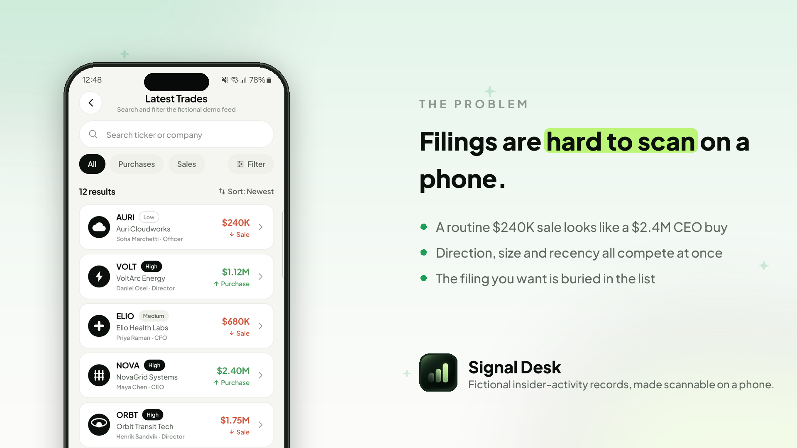
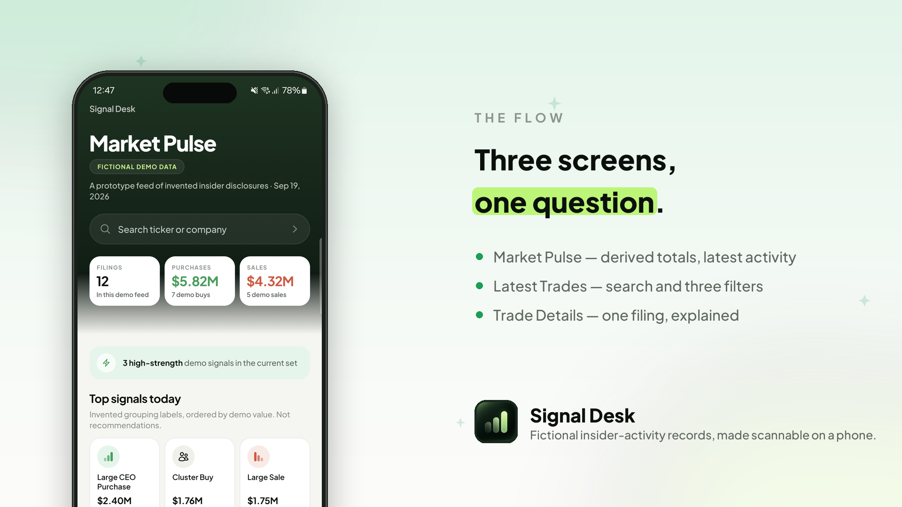
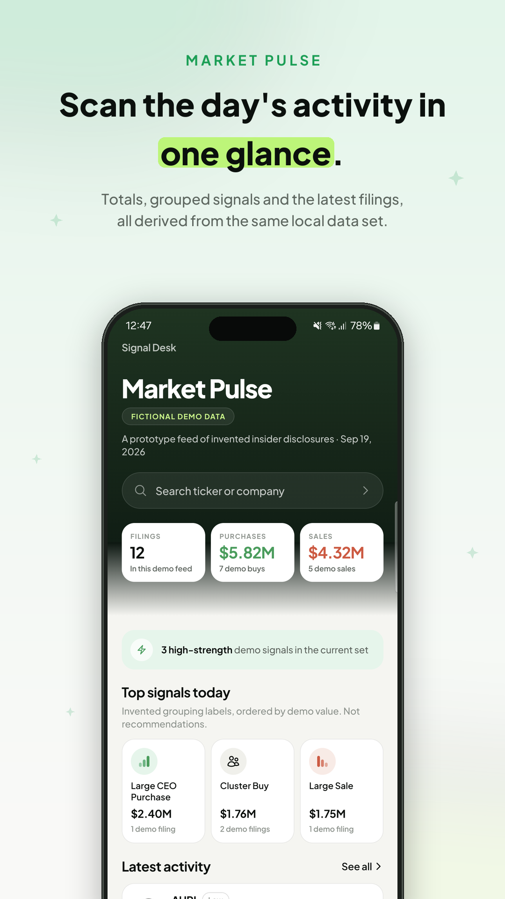
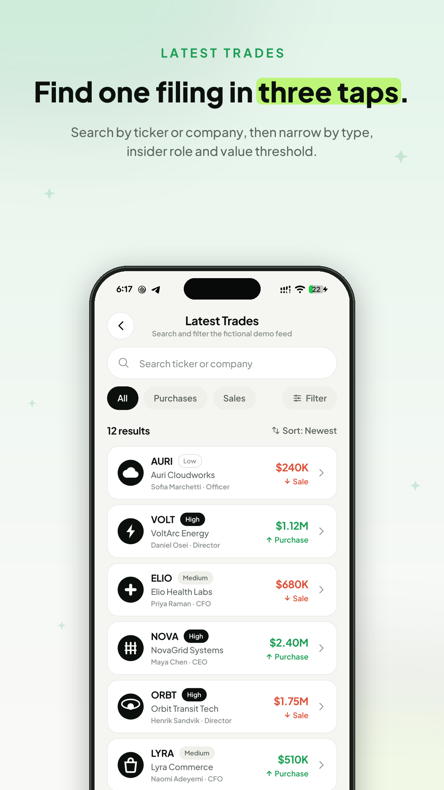
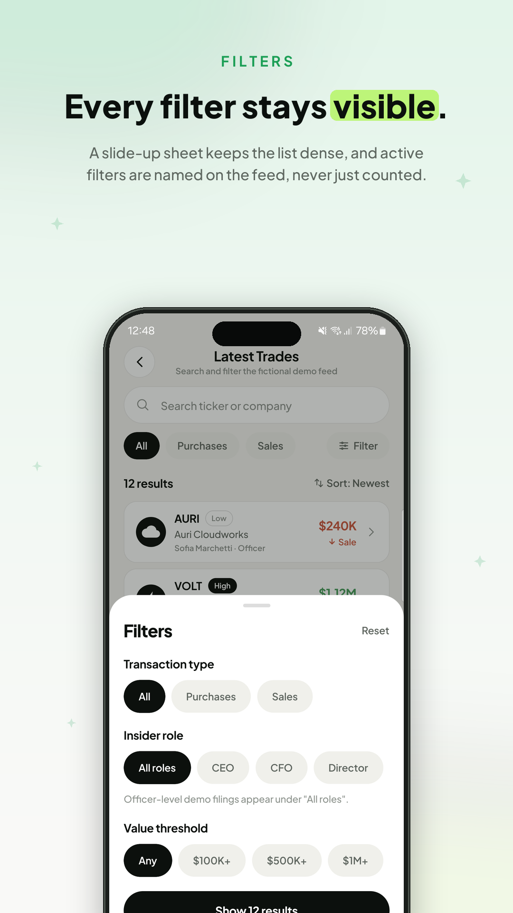
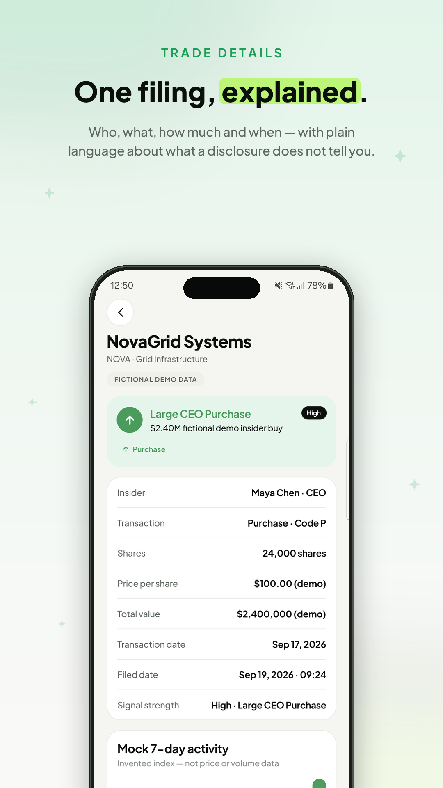
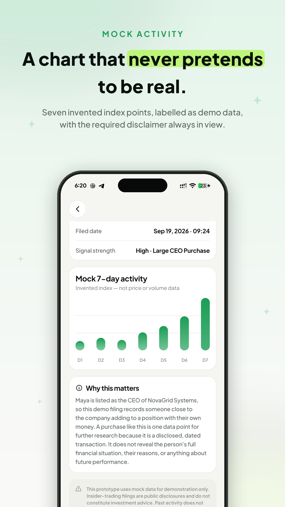
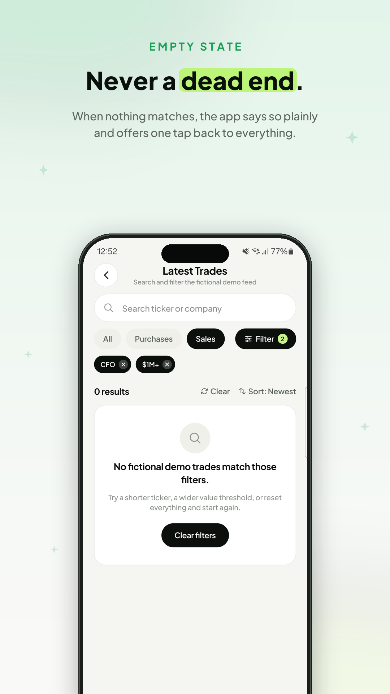
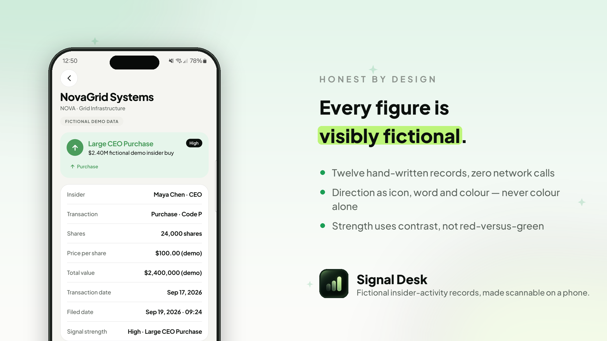
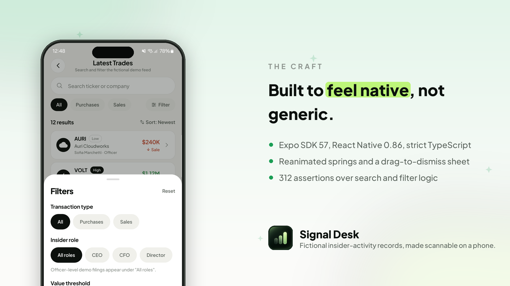

# Signal Desk

**A three screen React Native prototype for scanning fictional insider activity records on mobile.**

Original mobile concept inspired by the broad insider-activity product category; all displayed
content is fictional mock/demo data.

---

## Project overview

Disclosed insider transactions are, in principle, public information, but on a phone they are
awkward to work with. The raw form is a long, undifferentiated list in which a routine $240K
scheduled sale looks exactly like a $2.4M purchase by a sitting CEO. The reader has to hold several
variables in their head at once (who, which direction, how much, how recently) before anything
stands out.



Signal Desk is a prototype answer to one narrow question: **on a small screen, how quickly can
someone go from "show me what happened" to "I understand this one filing"?**

This is a prototype and an interface study, not an investing tool.

## Screens and features



### Launch

The native splash shows the bare brand green and nothing else. The mark springs in with a wobble,
the wordmark rises beneath it, and the cover lifts away onto Market Pulse
([`LaunchScreen.tsx`](src/components/LaunchScreen.tsx)).

### 1. Market Pulse (Home)

- A forest green hero that resolves into the white working surface used by the rest of the app.
- Header with a `FICTIONAL DEMO DATA` badge.
- A "Search ticker or company" entry that opens the screener **with the field already focused**.
- Three summary cards (filing count, purchase value, sale value), each **derived from the same
  local array** that feeds the list below, so the headline numbers can never disagree with the
  feed. A fourth strip counts high strength signals.
- **Top signals today**: labels grouped and ranked by demo value, computed at runtime.
- **Latest activity**: the four most recently filed records. Each one opens Details.

### 2. Latest Trades (Screener)

- Live local search over **ticker or company name, case insensitively**.
- Three independent filter groups, applied together with the search:

  | Group | Options | Rule |
  |---|---|---|
  | Transaction type | All · Purchases · Sales | matches `trade.type`, kept inline as the filter reached for first |
  | Insider role | All roles · CEO · CFO · Director | matches `trade.role`. `Officer` records stay under "All roles", stated in the sheet |
  | Value threshold | Any · $100K+ · $500K+ · $1M+ | keeps `trade.value >= threshold` |

- Role and value live in a **slide up sheet** with a grab handle and drag to dismiss. Its confirm
  button reports the outcome (`Show 6 results`) rather than implying a pending change, because
  filters apply live as chips are tapped.
- Any filter set in the sheet is then **named on the feed** as a removable chip (`CEO ×`, `$1M+ ×`),
  so a narrowed list never leaves the user wondering where the data went.
- A live result count, a sort toggle (`Sort: Newest` / `Sort: Largest`) and a Clear action.
- An actionable empty state: *"No fictional demo trades match those filters."*

### 3. Trade Details

- Back button, company name, ticker, sector and a `FICTIONAL DEMO DATA` badge.
- A prominent signal card, for example *"Large CEO Purchase, $2.40M fictional demo insider buy"*.
- A structured breakdown: insider and role, transaction type and code, shares, price per share,
  total value, transaction date, filed date, signal strength.
- **Mock 7 day activity**: pill shaped bars that grow on mount, echoing the app mark, drawn from a
  seven number array on the record. Labelled as an invented index, with no numeric axis.
- A **"Why this matters"** explainer generated per record, written so that it never suggests an
  action, a direction or an outcome.
- The required disclaimer, rendered verbatim.

## Screenshots

Captured on a physical Samsung Galaxy S21 FE 5G (Android 14, 1080×2340, 411dp wide).

| Market Pulse | Latest Trades | Filters |
|---|---|---|
|  |  |  |

| Trade Details | Mock activity | Empty state |
|---|---|---|
|  |  |  |

## Concept and data statement



- This is an **original mobile concept** inspired only by the broad product category that
  StockInsider.io belongs to: turning disclosed insider activity into a focused mobile discovery
  and research flow.
- **StockInsider.io was not used as a data, copy, or UI source.** Its screens were not reproduced,
  its wording was not reused, its layout was not recreated, and none of its transaction information
  appears here. Nothing was scraped, screenshotted, downloaded or connected to.
- **All data is local fictional mock/demo data.** Every company, ticker, person, price, share
  count, date, signal label and chart point was invented for this prototype and is written by hand
  in [`src/data/mockTrades.ts`](src/data/mockTrades.ts). The tickers (`NOVA`, `ELIO`, `VOLT`,
  `AURI`, `MESA`, `LYRA`, `ORBT`, `SOLA`, `KIRA`, `PYLN`, `VERT`, `HALO`) are invented and do not
  correspond to real listings. The company marks are geometric glyphs drawn from primitives in
  [`CompanyMark.tsx`](src/components/CompanyMark.tsx), and none is a real company's logo.
- **No figure came from a market data source.** No SEC/EDGAR filing, market API, exchange feed or
  downloaded dataset was consulted at any point.
- **The app makes no network requests.** There is no `fetch`, no HTTP client, no API key and no
  backend anywhere in the source, and the release build ships without the `INTERNET` permission.

Every screen carries a visible `FICTIONAL DEMO DATA` badge or an equivalent "demo" qualifier, and
monetary figures on the details screen keep a `(demo)` suffix.

## Design approach

Design inspiration was taken from **Dribbble**, then adapted into an original layout with its own
palette, typography, components and copy.

The priority for this build was the **visual and experience layer**. The goal was an interface a
first time user can operate without instruction, where the app answers back at every step so the
user never feels lost:

**The user always knows what state they are in.** A narrowed list names its own filters as
removable chips, rather than leaving the user to decode a numeric badge. The result count updates
live. The sort control says `Sort: Newest` rather than just `Newest`, so a two state toggle is not
a guess.

**Every action gets a response.** Each tappable surface shares one springy recess through
`PressableScale`. Rows, cards and sections animate in with a short stagger, so a filtered list
resolves rather than snapping. Chart bars grow on mount. The filter sheet slides on a spring and
can be dragged away.

**Nothing is a dead end.** The empty state states plainly what happened and offers one tap back to
everything. Back navigation preserves the search and filters the user had set.

**No decorative controls.** Nothing that looks tappable is inert. A sort control was implemented
rather than shown as an empty affordance, and no notification or settings icon was added, because
neither would do anything.

**Transaction direction is never carried by colour alone.** Every purchase or sale indicator
renders an arrow, the literal word "Purchase" or "Sale", *and* a colour, routed through a single
`DirectionTag` component so the guarantee cannot be forgotten at a call site.

**Signal strength is expressed as contrast, not hue.** High is a solid ink pill, Medium a soft grey
fill, Low a hairline outline. Nothing borrows the purchase or sale palette, so prominence in the
feed can never be misread as a recommendation.

**Filters are visible, not counted.** The three groups stacked inline consumed roughly 800px of a
2340px screen and pushed the first result nearly halfway down the page. Moving role and value into
a sheet fixed the density.

**Company marks instead of letter monograms.** Shape is recognisable in peripheral vision in a way
a letterform is not, which matters in a dense feed.

**Accessibility.** Every icon only control has an `accessibilityLabel`. Touch targets are at least
44dp. Rows expose a full spoken summary including the "demo data" qualifier, and chips report their
selected state.

An 8 point spacing rhythm runs throughout (8, 12, 16, 20, 24), with 14 to 22px corner radii and
hairline borders rather than heavy shadows.

## Tech stack



| Concern | Choice |
|---|---|
| Framework | Expo SDK 57, React Native 0.86, React 19 |
| Language | TypeScript (`strict: true`) |
| Navigation | `@react-navigation/native` + `native-stack` |
| Animation | `react-native-reanimated` 4 + `react-native-gesture-handler` |
| Vector work | `react-native-svg` (chart, icon set, company marks) |
| Gradients | `expo-linear-gradient` |
| Typeface | Plus Jakarta Sans via `@expo-google-fonts` + `expo-font` |
| Layout | `react-native-safe-area-context` |
| State | React `useState` / `useMemo` only |

**No icon font ships with the app.** [`src/components/icons/Icon.tsx`](src/components/icons/Icon.tsx)
is generated from the `heroicons` npm package (MIT, v2.2.0) at build time, so the SVG path data is
copied verbatim rather than written by hand, and rendered through `react-native-svg`. Brand glyphs,
meaning the ascending and descending pill bars and the direction arrows, are drawn in
[`BrandIcons.tsx`](src/components/icons/BrandIcons.tsx). No emoji or platform default glyphs are
used anywhere.

No global state library. For a prototype of this size, screen level state over a local mock data
import is the appropriate amount of machinery.

## Setup

```bash
git clone <repository-url>
cd signal-desk
npm install
npx expo start
```

Then press `a` for Android, `i` for iOS, or scan the QR code with Expo Go.

To build the Android APK from this same code:

```bash
npx expo prebuild --platform android
cd android
./gradlew assembleRelease
# output: android/app/build/outputs/apk/release/app-release.apk
```

That produces a universal APK covering four CPU architectures. For a modern 64 bit phone only,
which is considerably faster:

```bash
./gradlew assembleRelease -PreactNativeArchitectures=arm64-v8a
```

> The release build is signed with the generated debug keystore, which is fine for a review build
> but not for distribution.

## Project structure

```
src/
  data/mockTrades.ts             12 fictional records written by hand
  types/trade.ts                 domain + filter types
  navigation/AppNavigator.tsx    stack + route params
  hooks/useStatusBarStyle.ts     per screen status bar, bound to focus
  screens/HomeScreen.tsx
  screens/ScreenerScreen.tsx
  screens/TradeDetailsScreen.tsx
  components/LaunchScreen.tsx    animated launch sequence
  components/FilterSheet.tsx     slide up sheet, drag to dismiss
  components/TradeRow.tsx
  components/CompanyMark.tsx     12 monochrome company glyphs
  components/MockActivityChart.tsx
  components/ActiveFilterChip.tsx
  components/FilterChip.tsx
  components/SummaryCard.tsx
  components/SignalBadge.tsx
  components/DirectionTag.tsx    the only place direction is rendered
  components/SearchField.tsx     one affordance, button + input modes
  components/PressableScale.tsx  the app's single press behaviour
  components/icons/Icon.tsx      generated from Heroicons
  components/icons/BrandIcons.tsx
  theme/colors.ts                colour, spacing, radius, motion tokens
  theme/type.ts                  type scale
  utils/formatters.ts            currency, share, date, relative time
  utils/filterTrades.ts          the screener's pure search, filter and sort
  utils/education.ts             per record explainer + required disclaimer
```

Only the trade **id** travels through navigation params. The details screen resolves the record
from local data, so there is a single source of truth.

## Testing

### Automated checks

TypeScript compiles clean under `strict`, and the app bundles for Android without errors:

```bash
npx tsc --noEmit
npx expo export --platform android
```

The screener's search, filter and sort logic is extracted into a pure function
([`src/utils/filterTrades.ts`](src/utils/filterTrades.ts)) so it can be tested independently of
rendering. **312 assertions** cover data integrity, every filter option, case insensitive search on
both ticker and company, combined filters, sort order, the badge count, all formatters, the
verbatim disclaimer, and a check that no explanatory copy contains advisory language.

| | all | purchases | sales | CEO | CFO | Director | $100K+ | $500K+ | $1M+ |
|---|---|---|---|---|---|---|---|---|---|
| results | 12 | 7 | 5 | 3 | 3 | 4 | 12 | 8 | 4 |

### Manual testing on a physical device

The release APK was installed on a physical **Samsung Galaxy S21 FE 5G (Android 14)** and tested
by hand over **wireless debugging (ADB over Wi-Fi)**. The UI automation and log inspection during
that session were driven with the assistance of **Claude (AI)**, which installed builds, walked the
screens, captured screenshots and read `logcat`, while the behaviour was checked against the
brief's requirements. **49 of 49 checks passed:**

- Launches straight to Market Pulse. `logcat` reports **zero error level entries** for the process.
- Home shows the search entry, three summaries, top signals, four latest cards, CTA and footnote.
  Derived totals render as `12 filings`, `$5.82M` across 7 buys, `$4.32M` across 5 sales.
- Tapping Home's search bar opens the screener **with the field focused**.
- All three filter groups work independently and together. Purchases + CEO + $1M+ gives `1 result`.
- Search matches a ticker only (`orbt` finds ORBT) and a company name only (`novagrid` finds NOVA),
  both in lower case.
- `Sales + CFO + $1M+` and a nonsense query both reach the empty state.
- Details shows every required field and stays internally consistent
  (24,000 × $100.00 = $2,400,000), with chart, education copy and the verbatim disclaimer.
- Back returns from Details to the screener with search and filters intact, then to Market Pulse.
- The launch log records `0ms mobile, 0ms wifi`, matching the no network claim.

## Security testing

Because this prototype handles no accounts and no real data, the review focused on what the app
ships, what it is permitted to do, and what it depends on.

| Check | Method | Result |
|---|---|---|
| Network calls in source | grep for `fetch`, `axios`, `XMLHttpRequest`, `WebSocket` | None found |
| Remote code execution surface | grep for `eval`, `Function(`, `WebView`, `dangerouslySetInnerHTML` | None found |
| Hardcoded secrets | grep for API keys, tokens, passwords, private keys | None found |
| Runtime network activity | Android launch log on device | `0ms mobile, 0ms wifi` |
| Android permissions | `aapt dump permissions` on the release APK | Reduced to none, see below |
| Dependency vulnerabilities | `npm audit --omit=dev` | 11 moderate, all one advisory, build time only |

**Permission reduction.** The first release build inherited five permissions from the Expo
template: `INTERNET`, `SYSTEM_ALERT_WINDOW`, `VIBRATE`, `READ_EXTERNAL_STORAGE` and
`WRITE_EXTERNAL_STORAGE`. None of them is used by this app. They are now removed through
`android.blockedPermissions` in [`app.json`](app.json), so the shipped APK declares **no standard
Android permissions**. The only entry left is
`com.signaldesk.demo.DYNAMIC_RECEIVER_NOT_EXPORTED_PERMISSION`, a signature level permission that
AndroidX generates for the app's own internal broadcast receivers; it grants nothing outside the
app and cannot be held by another package.

Dropping `INTERNET` in particular turns the "no network calls" claim from a promise about the code
into something the operating system enforces. After the change the full 49 check device pass was
repeated on the same phone with identical results, and `logcat` showed no `SecurityException` and
no permission denials, confirming nothing in the app depended on those permissions.

**Dependency advisory.** `npm audit` reports 11 moderate findings, all tracing to a single
advisory, [GHSA-w5hq-g745-h8pq](https://github.com/advisories/GHSA-w5hq-g745-h8pq), a missing
buffer bounds check in `uuid`. It enters the tree through
`expo-splash-screen → @expo/config-plugins → xcode → uuid`. `xcode` is an iOS project file
manipulation library that runs during `expo prebuild`, so this code is build time tooling and is
never bundled into the Android APK. It is not referenced by any application source file. No fix is
available without an upstream Expo release.

**Not covered.** There is no server, no authentication and no stored user data, so there was no
transport security, session, injection or access control testing to perform. A penetration test of
the APK itself (for example repackaging or tamper resistance) was out of scope for a prototype
signed with a debug keystore.

## Known limitations

- **Static local data.** Twelve records written by hand. Nothing is fetched, refreshed or persisted.
- **No live filings, market data or backend** of any kind, by design.
- No authentication, accounts, portfolio, watchlist, alerts or notifications.
- No date range filter or pagination, since the screener filters a small fixed array.
- The 7 day chart is a static invented series per record. It is not interactive and has no axis
  values, because labelled values would invite reading it as real market data.
- Filter and sort state are not persisted across launches.
- Tested on a physical Samsung Galaxy S21 FE 5G (Android 14). The iOS layout uses the same safe
  area aware code but was **not verified on an iOS device**.
- `assets/splash-blank.png` is an intentionally transparent image. `expo-splash-screen` always
  writes a `@drawable/splashscreen_logo` reference into `styles.xml` but only generates that
  drawable when an `image` is supplied, so omitting it fails resource linking. The transparent
  placeholder yields the bare green splash the design calls for.

## AI use disclosure

Every tool used on this project, and what each was actually used for.

**Design and UX direction (mine).** I designed the UI and UX. I researched mobile patterns on
**Mobbin** and **Dribbble**, then used **ChatGPT** to turn a written brief into a reference mockup
of the three screens. That mockup became the visual reference I handed to Claude Code to build
from, followed by manual tweaking of layout, colour and motion until the app felt lively rather
than static.

**Implementation (Claude Code, Anthropic).** Claude Code did the heavy lifting on the codebase:
scaffolding the Expo and TypeScript project, writing the screens, components, mock data, filter
logic, the generated icon set and this README. I have practical React Native and Expo experience,
having worked as a teaching assistant on the Ostad React Native Expo batch, so I guided the work,
reviewed the output at each step and corrected it where it went in the wrong direction.

**Testing (shared).** I tested the app by hand on my own Samsung Galaxy S21 FE and checked the
behaviour against the brief's requirements myself. Claude then ran the checklist again over
wireless debugging, capturing screenshots and reading `logcat`, and carried out the security
review: the permission audit, the dependency audit, and the source scans for network calls,
secrets and dynamic code execution.

No AI generated work was submitted without review. I can explain the architecture, the filter
logic and the design decisions in the submitted code.

## Deliverables

| Asset | Link |
|---|---|
| GitHub repository | `<add link>` |
| Google Drive folder (APK, screenshots, video) | `<add link>` |
| APK | `android/app/build/outputs/apk/release/app-release.apk` |
| Screenshots | [`docs/screenshots/`](docs/screenshots) |
| Feature graphics | [`docs/graphics/`](docs/graphics) |
| Demo video (1 to 3 min) | `<in Drive folder>` |

---

*Original mobile concept inspired by the broad insider-activity product category; all displayed
content is fictional mock/demo data. This prototype uses mock data for demonstration only.
Insider-trading filings are public disclosures and do not constitute investment advice. Past
activity does not guarantee future stock performance.*
